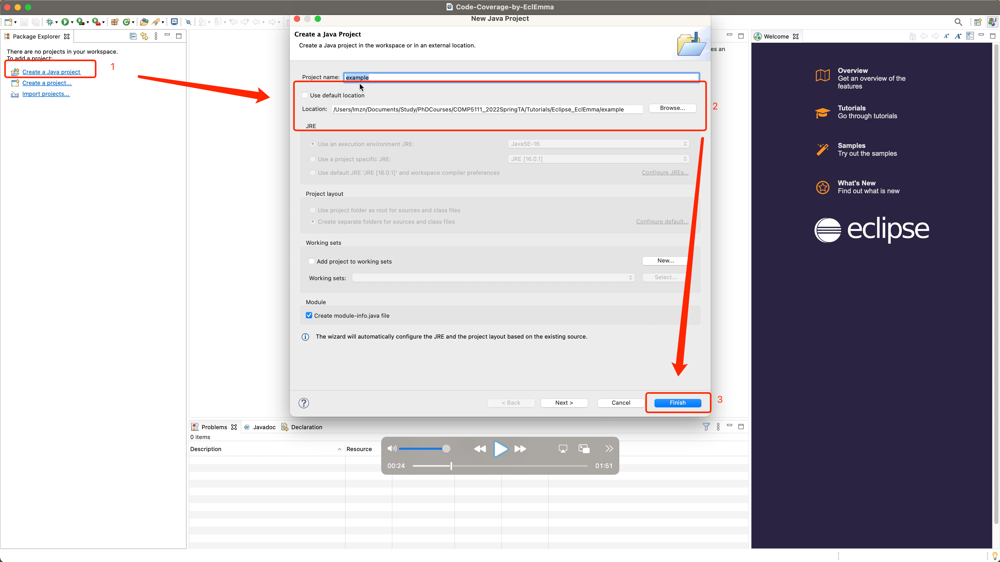
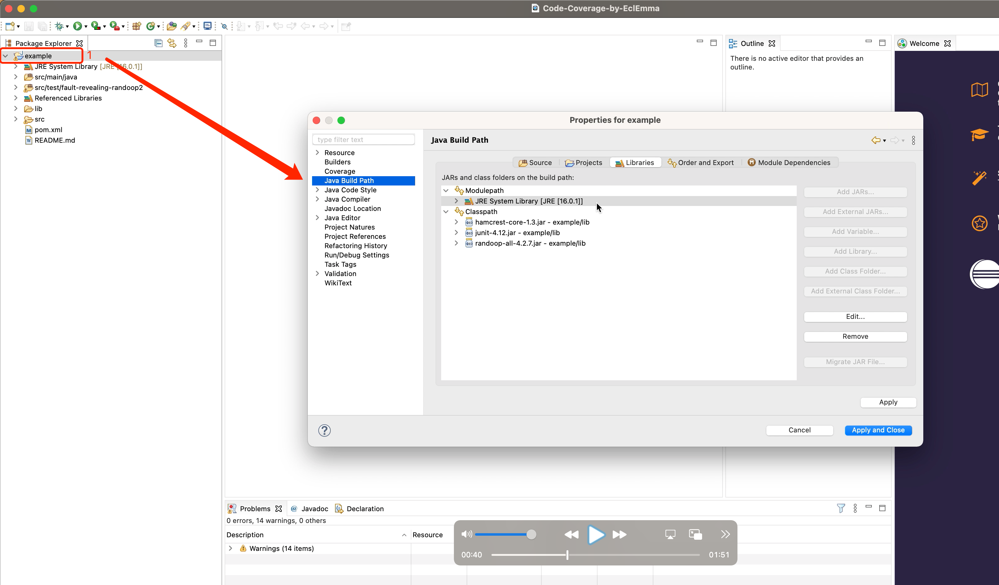
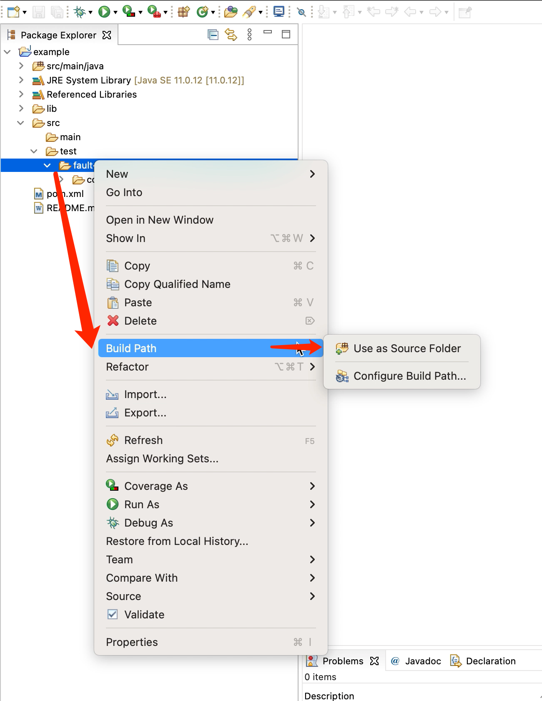
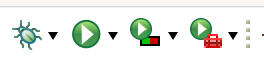
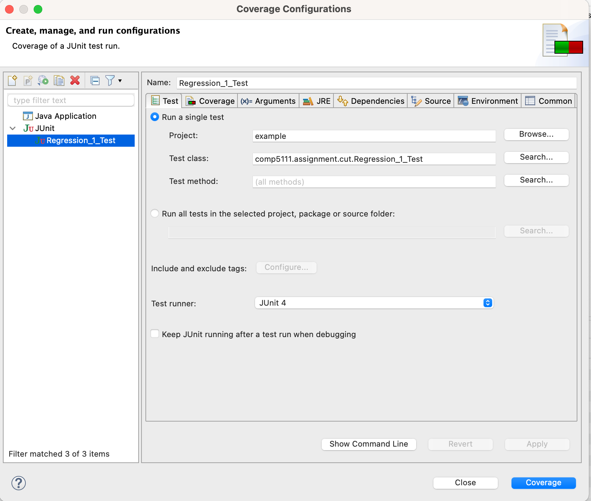
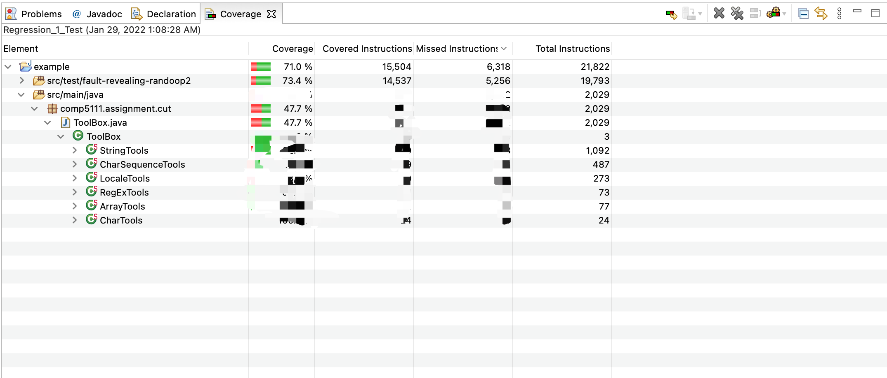
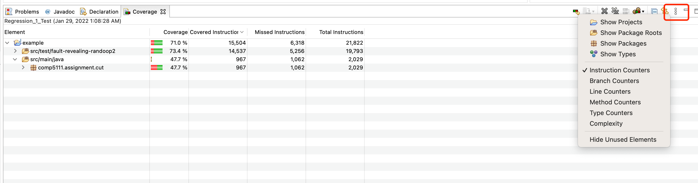

# Test coverage measurement using EclEmma on Eclipse

## Introduction

In this tutorial, you will learn how to use the toolkit EclEmma in Eclipse to measure test coverage. 

(Please note that some screenshots and demo video are materials of last year's course, they are only for this tutorial.)

## Steps

You can follow these steps to build the JAVA project on Eclipse, then use EclEmma to generate test coverage reports. The [demo video](https://drive.google.com/file/d/1DZAGe0WpumKhFayyKqE2bDjnS3t9D42i/view?usp=sharing) is available.

### Step 0: Install Eclipse 2023-12 and EclEmma
You can install the Eclipse 2023-12 following the [official website](https://www.eclipse.org/downloads/packages/)
If you have already installed the Eclipse with the old version, you may upgrade your Eclipse through [this link](https://wiki.eclipse.org/FAQ_How_do_I_upgrade_Eclipse_IDE%3F)

**NOTE**: EclEmma is already in Eclipse 2023-12 by default. You may skip this step.


### **Step 1: Create a JAVA project on Eclipse**

As you already have the test subject and the generated subject, you need to create a JAVA project from existing folders instead of building a JAVA project from scratch. Below shows you how to do so (suppose we want to create a JAVA project based on the following example folder)

```(base)  example  tree ./
./
├── README.md
├── lib
│   ├── hamcrest-core-1.3.jar
│   ├── junit-4.12.jar
│   └── randoop-all-4.3.1.jar
├── pom.xml
└── src
    ├── main
    │   └── java
    │       └── comp5111
    │           └── assignment
    │               └── cut
    │                   └── ToolBox.java
    └── test
        └── fault-revealing-randoop2
            └── comp5111
                └── assignment
                    └── cut
                        ├── Regression_1_Test.java
                        └── Regression_1_Test0.java

12 directories, 8 files
```

**Step 1-1:** Create the new Java project by setting the existing location




**Step 1-2:** [Right click the project name] -> [Properties] to configure the `Java Build Path` and `Java Compiler`. 

When configuring the `Java Build Path`. You need to set the `JRE System Library` to JRE 11, and add the dependency jar to the `Classpath`. You can know how to do so through the [demo video](https://drive.google.com/file/d/1DZAGe0WpumKhFayyKqE2bDjnS3t9D42i/view?usp=sharing).



When configuring Java Compiler, you also need to change the `Compiler compliance level` to `11`

**Step 1-3:** Add test subject and the generated test suites to classpath

To let eclipse find your test subject and test suites, you need to add these java files to the the build path. Below shows you how to do so.




### Step 2: Launching in Coverage Mode

Eclipse allows running Java programs directly from the workbench. Programs can be launched in different so called launch modes. In a standard Eclipse installation you can launch your programs either in Run or in Debug mode. EclEmma adds a new launch mode Coverage which is available from the Run menu and the toolbar:



Existing launch configurations can be launched directly in Coverage mode using default settings. As with the Run and Debug mode you might also select a Java element and launch it directly from the Coverage As context menu. If required, some settings can be modified in the coverage configurations:



### Step 3: View Test Coverage Report

The Coverage view automatically appears when a new coverage session is added or can manually opened from the Window → Show View menu in the Java category. It shows coverage summaries for the active session.



 

The Coverage view shows all analyzed Java elements within the common Java hierarchy. Individual columns contain the following numbers for the active session, always summarizing the child elements of the respective Java element:

- Coverage ratio
- Items covered
- Items not covered
- Total items

The elements may be sorted in ascending or descending order by clicking the respective column header. Double-clicking an element opens its declaration in an editor with highlighted source code. You can select between different metrics, see last section for details.

 

Some of the actions are deactivated if there is no session or only a single session. More settings are available form the coverage view's drop-down menu:



 

- **Show Elements:** Select Java elements shown as root entries in the coverage tree: Projects, package fragment roots (source folders or libraries), package fragments or types.
- **Counter Mode:** Different counter modes can be selected from the view's drop-down menu: bytecode instructions, branches, lines, methods, types and cyclomatic complexity.
- **Hide Unused Elements:** Filter all elements from the coverage view that have not been executed at all during the coverage session.

